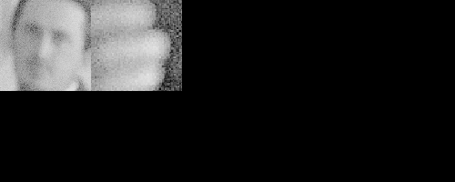
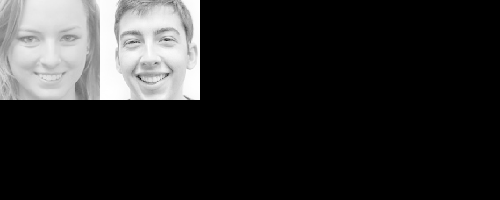
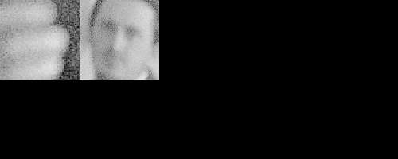
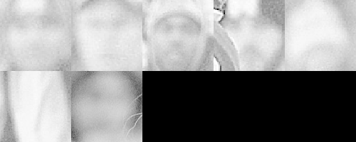

# The Project #
1. This is a project with minimal scaffolding. Expect to use the the discussion forums to gain insights! It’s not cheating to ask others for opinions or perspectives!
2. Be inquisitive, try out new things.
3. Use the previous modules for insights into how to complete the functions! You'll have to combine Pillow, OpenCV, and Pytesseract
4. There are hints provided in Coursera, feel free to explore the hints if needed. Each hint provide progressively more details on how to solve the issue. This project is intended to be comprehensive and difficult if you do it without the hints.

### The Assignment ###
Take a [ZIP file](https://en.wikipedia.org/wiki/Zip_(file_format)) of images and process them, using a [library built into python](https://docs.python.org/3/library/zipfile.html) that you need to learn how to use. A ZIP file takes several different files and compresses them, thus saving space, into one single file. The files in the ZIP file we provide are newspaper images (like you saw in week 3). Your task is to write python code which allows one to search through the images looking for the occurrences of keywords and faces. E.g. if you search for "pizza" it will return a contact sheet of all of the faces which were located on the newspaper page which mentions "pizza". This will test your ability to learn a new ([library](https://docs.python.org/3/library/zipfile.html)), your ability to use OpenCV to detect faces, your ability to use tesseract to do optical character recognition, and your ability to use PIL to composite images together into contact sheets.

Each page of the newspapers is saved as a single PNG image in a file called [images.zip](./readonly/images.zip). These newspapers are in english, and contain a variety of stories, advertisements and images. Note: This file is fairly large (~200 MB) and may take some time to work with, I would encourage you to use [small_img.zip](./readonly/small_img.zip) for testing.

Here's an example of the output expected. Using the [small_img.zip](./readonly/small_img.zip) file, if I search for the string "Christopher" I should see the following image:

If I were to use the [images.zip](./readonly/images.zip) file and search for "Mark" I should see the following image (note that there are times when there are no faces on a page, but a word is found!):


Note: That big file can take some time to process - for me it took nearly ten minutes! Use the small one for testing.


```python
from zipfile import *
from PIL import Image
from PIL import ImageDraw
import pytesseract
import cv2 as cv
import numpy as np
import PIL

#global data structure
global_ds = []

# zipped file
zip_file = 'readonly/images.zip'

# loading the face detection classifier
face_cascade = cv.CascadeClassifier('readonly/haarcascade_frontalface_default.xml')


# routine that returns the list of words in the text
def extract_text(file):
    text               = pytesseract.image_to_string(file)
    text_to_list       = text.split()
    return map(lambda x:x.lower(),text_to_list)

# get grayscaleimage
def get_grayscale_image(image_file):
    img        = cv.imread(image_file)
    gray       = cv.cvtColor(img, cv.COLOR_BGR2GRAY)
    return gray

#routine that contains the bounding boxes for each face in a given image     
def get_bounding_boxes(file):
    bounding_boxes = []
    img     = get_grayscale_image(file)
    faces   = face_cascade.detectMultiScale(img,scaleFactor=1.3,minNeighbors=4, minSize=(30,30))
    if faces != ():
        recs    = faces.tolist()
        pil_img = Image.fromarray(img,mode="L")
        for rec in recs:
            upper = rec[0]
            left  = rec[1]
            right = rec[0]+rec[2]
            bottom= rec[1]+rec[3]
            face_img = pil_img.crop((upper,left,right,bottom))
            face_img = face_img.resize((100,100))
            bounding_boxes.append(face_img)
        return bounding_boxes 

# extract images and creat global 
def store_global_ds(zipped_file):
    files         = ZipFile(zipped_file, "r")
    name_of_files = files.namelist()
    for name in name_of_files:
        image_ds       = {}
        file           = files.extract(name)
        extracted_text = extract_text(file)
        bounding_boxes = get_bounding_boxes(file)
    
        image_ds['name']   = file
        image_ds['text']   = extracted_text
        image_ds['bboxes'] = bounding_boxes
        global_ds.append(image_ds)
        

# the text lookup function

def lookup_keyword(new_word):
    word = new_word.lower()
    store_global_ds(zip_file)
    for each_dict in global_ds:
        if each_dict['bboxes'] is not None and word in each_dict['text']:
            print('Results found in {}'.format(each_dict['name'].split('/')[-1]))
            contact_sheet = PIL.Image.new('RGB',(500,200),color="black")
            x=0 
            y=0
            for face in each_dict['bboxes']:
                contact_sheet.paste(face,(x,y))
                if x+100 == contact_sheet.width:
                    x=0
                    y=y+100
                else:
                    x=x+100
            display(contact_sheet)
        elif each_dict['bboxes'] is None and word in each_dict['text']:
            print('Results found in {}'.format(each_dict['name'].split('/')[-1]))
            print('But there were no faces in that file!')
            
            

lookup_keyword('Mark')


```

    Results found in a-0.png


    Results found in a-1.png





    Results found in a-10.png
    But there were no faces in that file!
    Results found in a-2.png





    Results found in a-3.png





    Results found in a-5.png





    Results found in a-8.png
    But there were no faces in that file!
    Results found in a-9.png


```python

```


```python

```


```python

```
